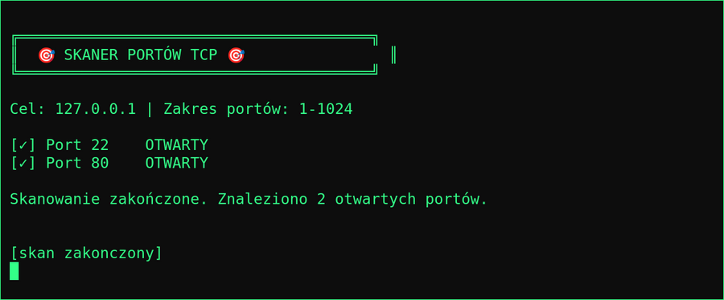

# Hackerski Podręcznik C 🎯

Nauka **języka C od zera** na praktycznych, „hakerskich" mini-programach —
od `Hello World` aż po **działający skaner portów TCP**. Każdy rozdział to jeden
samodzielny plik `.c`, który wprowadza nowy element języka, opakowany w coś,
co realnie robi wrażenie w terminalu.

> 🎓 Materiał **edukacyjny**. Wszystkie przykłady są lokalne i nieszkodliwe.
> Skanuj i testuj **wyłącznie** systemy, do których masz uprawnienia.

<p align="center">
  <br>
  <sub>Finałowy projekt — skaner portów TCP w akcji (skan własnego <code>127.0.0.1</code>).</sub>
</p>

## Rozdziały

| # | Plik | Czego uczy | Motyw |
|:---:|---|---|---|
| 01 | `rozdzial01_hello_world.c` | `printf`, pierwszy program, kompilacja | Tryb hakera aktywny |
| 02 | `rozdzial02_generator_kluczy.c` | typy, arytmetyka, operacje bitowe | Generator kluczy dostępu |
| 04 | `rozdzial04_bruteforce_pin.c` | pętle i warunki | Brute force 4-cyfrowego PIN-u |
| 05 | `rozdzial05_inspektor_pamieci.c` | wskaźniki, adresy, `sizeof` | Inspektor pamięci |
| 06 | `rozdzial06_toolkit.c` | funkcje (hash djb2, maska XOR) | Mini-toolkit |
| 07 | `rozdzial07_xor_cipher.c` | tablice, szyfrowanie XOR | Szyfr tajnej wiadomości |
| 09 | `rozdzial09_keylogger.c` | `termios`, tryb surowy terminala | Keylogger (demo lokalne) |
| 10 | `rozdzial10_analizator_logow.c` | pliki, parsowanie, detekcja | Analizator logów (wykrywa brute force) |
| ⭐ | `final_skaner_portow.c` | gniazda TCP, `connect`, `select`, timeouty | **Skaner portów** |
| ➕ | `network_scanner.c` | argumenty, wiele gniazd naraz | Skaner podsieci |

> Rozdziały **03 i 08** dojdą później — seria jest w trakcie pisania. 🚧

## Jak uruchomić

Potrzebujesz tylko `gcc` (na Linuksie zwykle już jest; `sudo apt install build-essential`).

```bash
# zbuduj wszystkie rozdziały do katalogu build/
make

# uruchom pojedynczy rozdział, np. Hello World
./build/rozdzial01_hello_world

# finałowy skaner portów (skanuj TYLKO własne systemy!)
./build/final_skaner_portow 127.0.0.1 1 1024
```

Albo pojedynczy plik ręcznie:

```bash
gcc -Wall -O2 -o skaner final_skaner_portow.c
./skaner 127.0.0.1 1 1024
```

## Dlaczego „hakerskie" przykłady?

Bo nauka idzie szybciej, gdy program robi coś ciekawego. Zamiast liczyć silnię,
piszemy szyfr XOR; zamiast sortować liczby — analizator logów, który wyłapuje
atak brute force. Ten sam materiał (pętle, wskaźniki, gniazda) — tylko z pazurem. 😎

## Licencja

MIT — ucz się, kopiuj, przerabiaj. Zbudowane do nauki i dla zabawy. 🛠️
